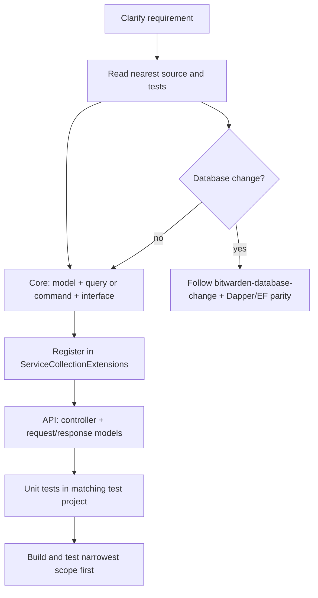

# Bitwarden Feature Implementation Guide

Shared execution reference for `build-feature` and `build-feature-e2e`.

## Flow

1. Clarify the requirement and identify the owning project in `bitwarden-server.slnx`.
2. Read the nearest controller, query/command, and test pattern before writing code.
3. Implement Core → DI → API → tests in that order.
4. If the feature touches the database, follow the database path before declaring done.
5. Verify with the narrowest useful command first, then broaden if risk is high.



## Layer Checklist

| Layer | Location | Pattern |
|-------|----------|---------|
| Data model | `src/Core/**/Models/` | Plain POCO; no vault plaintext |
| Query/Command | `src/Core/**/Queries/` or `Commands/` | CQS; `I{Name}Query` or `I{Name}Command` + impl |
| DI | `*ServiceCollectionExtensions.cs` | `TryAddScoped<I..., ...>()` |
| API model | `src/Api/**/Models/` | Response/request DTOs |
| Controller | `src/Api/**/Controllers/` | `ActionResult<T>`, `[Authorize(...)]` |
| Tests | `test/{Project}.Test/` | `[Theory, BitAutoData]`, `SutProvider<T>` |

## Reference Patterns

- Query-only read endpoint: `src/Api/Auth/Controllers/AccountVaultHealthController.cs`, `src/Core/Vault/Queries/GetVaultHealthAnalysisQuery.cs`
- When modifying existing service-based code, follow the local pattern unless the user asks for a CQS refactor.

## Skills To Load

Read these during implementation; do not duplicate their content here.

- `.cursor/skills/bitwarden-server-change/SKILL.md`
- `.claude/skills/writing-server-code/SKILL.md` — richer CQS, DI, and testing detail
- `.cursor/skills/bitwarden-database-change/SKILL.md` — only if SQL, repositories, or migrations change
- `.claude/skills/writing-database-queries/SKILL.md` — dual-ORM decisions and migration strategy
- `.claude/skills/implementing-dapper-queries/SKILL.md` — MSSQL/Dapper work
- `.claude/skills/implementing-ef-core/SKILL.md` — EF Core work

## Database Path

When repository or schema behavior changes:

1. Decide whether both Dapper and EF Core implementations are required.
2. Add MSSQL migration in `util/Migrator/DbScripts` when stored procedures or schema change.
3. Add `[DatabaseTheory, DatabaseData]` integration tests for repository parity.
4. Defer `_V2` stored-procedure versioning to the developer when the change is breaking.

## Security Gate

- Never log or test with real secrets, tokens, keys, passwords, or vault plaintext.
- Add denial-path tests for auth, authorization, crypto, or tenant-boundary changes.
- Use non-sensitive identifiers in logs, errors, fixtures, and snapshots.

## Verification Commands

Start narrow, then broaden:

```bash
dotnet build bitwarden-server.slnx
dotnet test test/Core.Test/Core.Test.csproj   # or the matching test project
dotnet test bitwarden-server.slnx             # only if high risk
```

For public API surface changes, consider:

```bash
pwsh dev/generate_openapi_files.ps1
```

## Done Checklist

- [ ] Behavior follows the nearest existing pattern in the changed area.
- [ ] Core logic lives in a query or command unless the file already uses a service.
- [ ] DI uses `TryAdd*` registration.
- [ ] Controller returns `ActionResult<T>` with appropriate authorization.
- [ ] Unit tests cover success paths and relevant denial or error paths.
- [ ] Database parity and integration tests added when repositories change.
- [ ] No sensitive data in logs, errors, tests, or examples.
- [ ] Build and targeted tests pass.
